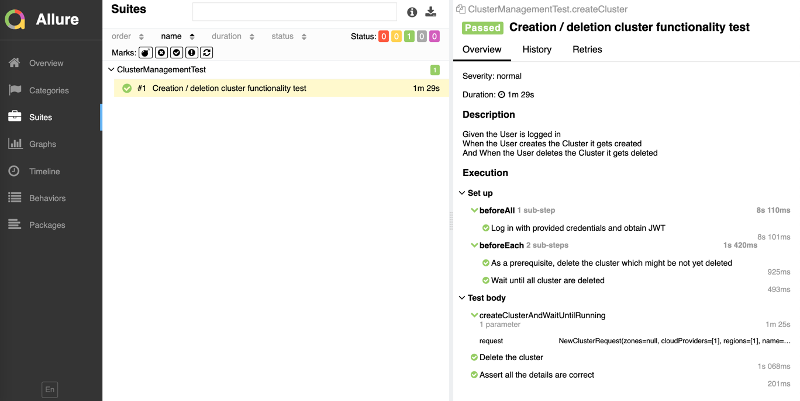

[](https://github.com/itesterok/hazelcast-cluster-api-test/actions/workflows/docker-image.yml)
# hazelcast-cluster-api-test
Testing task demonstrating interaction with hazelcast cluster api

## How to execute

### On github
Test is being executed automatically on github on each commit (employing github actions).
Email and Password are taken from the SECRETS settings.

### Locally
Upon cloning, please provide your own credentials in gradle.properties and then execute
```bash
./gradlew --continue clean test allureReport
```

## Reports
In addition to standard report an Allure report is generated in
```bash
./build/reports/allure-reports
```
When executed on github the reports might be found under the summary section of each build
(i.e. https://github.com/itesterok/hazelcast-cluster-api-test/actions/runs/1464608940)

Example os Allure report:


